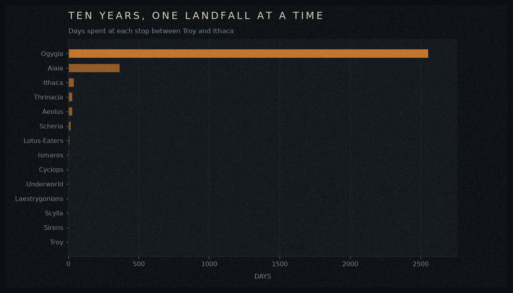
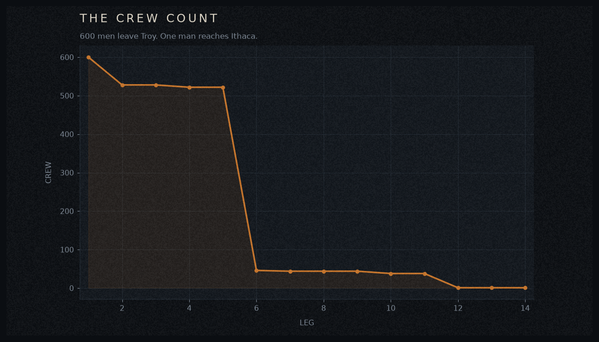
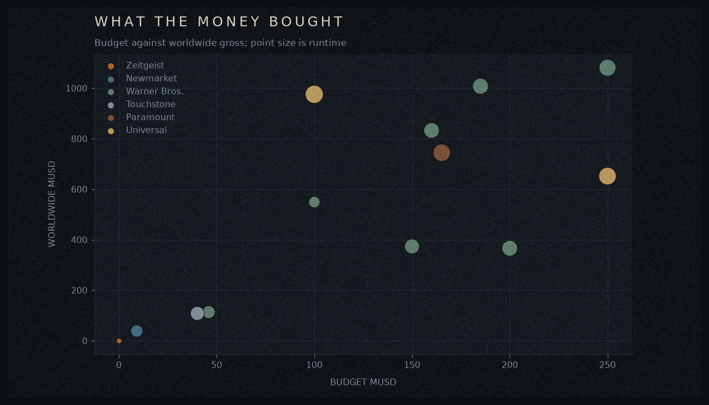
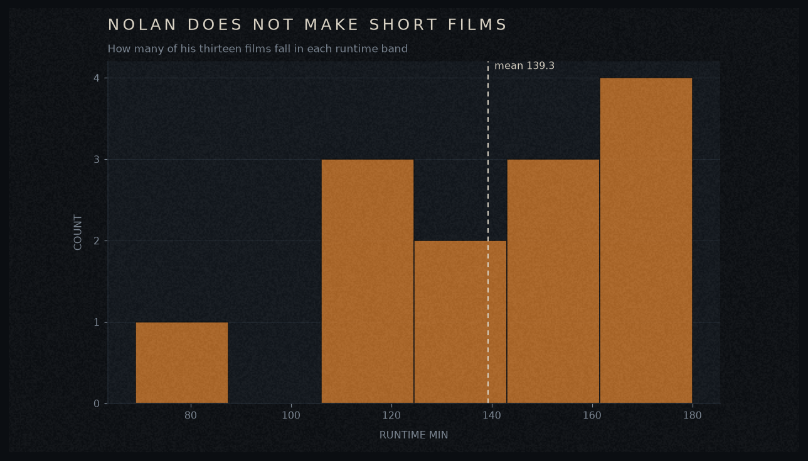

# odyssey-viz

Four matplotlib charts in one dark, Bronze Age house style — cold black frame,
hammered bronze, Aegean steel, and a faint layer of 70mm film grain.

Install name is `odyssey-viz-armand` (hyphens, for pip). Import name is
`odyssey_viz` (underscores, for Python).

## Install

```bash
pip install odyssey-viz-armand
```

Or, working from a clone of this repo:

```bash
python -m pip install -e .
```

## Use

```python
import odyssey_viz as ov

ov.use_theme()                  # apply the style to matplotlib
df = ov.sample_box_office()     # every film Nolan has directed

ax = ov.bars(df, x="title", y="worldwide_musd", title="Two films past a billion")
ov.save(ax, "gross.png")
```

Every chart takes a pandas DataFrame and returns a matplotlib `Axes`, so you can
keep working on it with plain matplotlib afterwards.

## The four charts

| Function | What it draws |
| --- | --- |
| `bars(df, x, y)` | Ranked horizontal bars; the top bar stays bright, the rest cool off |
| `line(df, x, y, group=None)` | A line over an ordered column, one per category if you pass `group` |
| `scatter(df, x, y, color=None, size=None)` | Points, optionally colored by category and sized by a numeric column |
| `histogram(df, column, bins=12)` | Distribution of one column, with the mean marked |

All four also take `title=`, `subtitle=`, and `ax=`.

### Supporting functions

- `use_theme(name="ithaca", grain=True)` — apply the style. `grain=False` turns off the film grain.
- `palette(name)` / `current_palette()` — the hex colors, if you want to reuse them.
- `save(ax, path, dpi=200)` — write the chart out at presentation resolution.
- `sample_box_office()` — the built-in dataset used in every example here.

## The sample dataset

`sample_box_office()` returns one row per Christopher Nolan feature, with
`title`, `year`, `studio`, `runtime_min`, `budget_musd`, `domestic_musd`, and
`worldwide_musd`. It is here to give the charts something to draw.

The figures come from public box office reporting, compiled 2026-07-31. Grosses
are lifetime and include re-releases; budgets are production budgets and exclude
marketing; `studio` is the lead domestic distributor, which simplifies two films
that split distributors by territory. The Odyssey is still in theaters, so its
row is a snapshot that goes stale immediately. Verify against a primary source
before citing any of it.

## Palettes

| Name | Reads as |
| --- | --- |
| `ithaca` (default) | Bronze against cold sea metal |
| `aegean` | Sea and sky; water, distance, time |
| `underworld` | Bone, ash, and rust; for grim subjects |

```python
ov.use_theme("aegean")
```

## Gallery

Rendered by `python examples/make_gallery.py`.






## Development

```bash
python -m pip install -e ".[dev]"
python -m pytest -q          # 10 tests
python -m build              # writes dist/*.whl and dist/*.tar.gz
python -m twine check dist/* # check before uploading
```

Publish to TestPyPI first, then PyPI:

```bash
python -m twine upload --repository testpypi dist/*
python -m twine upload dist/*
```

Use an API token, never a password, and never commit the token.

## License

MIT — see [LICENSE](LICENSE).
